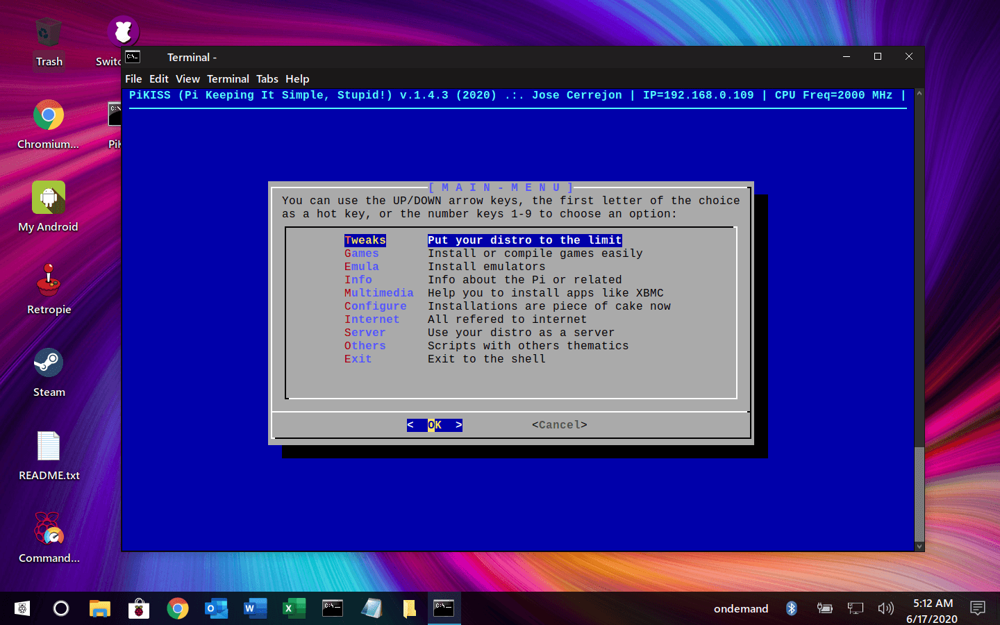
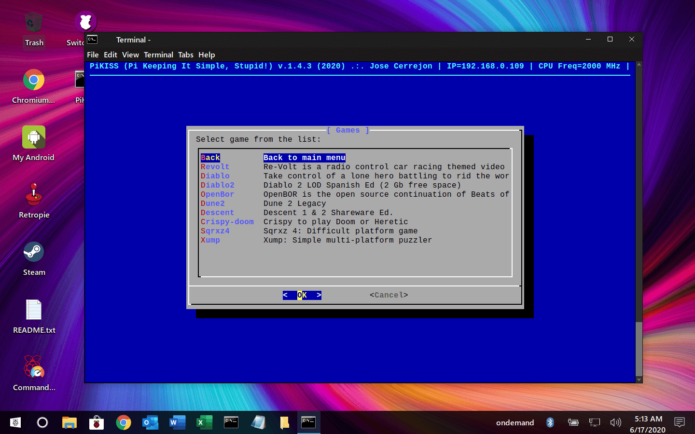
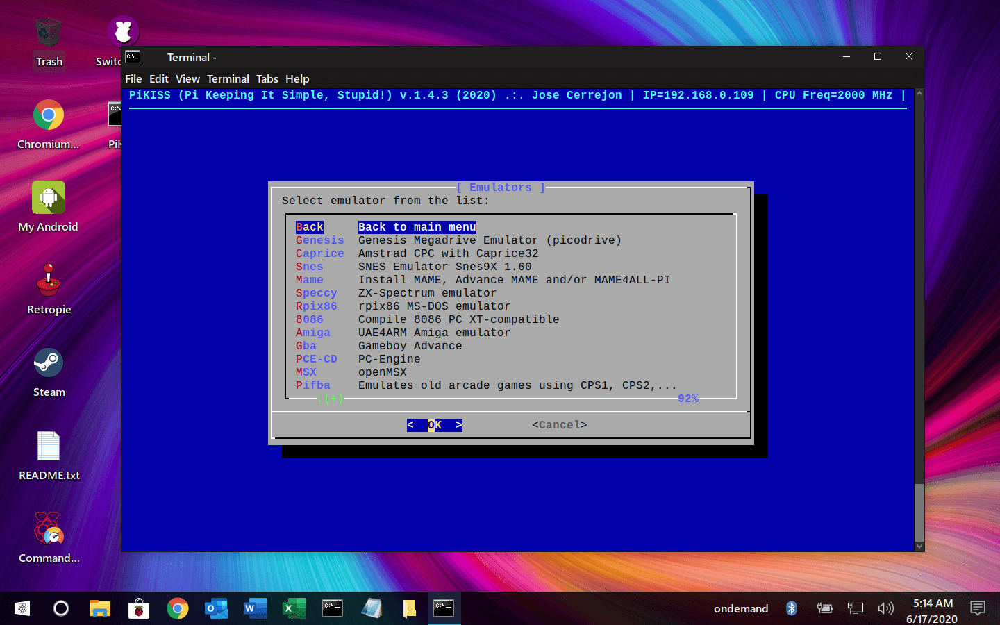
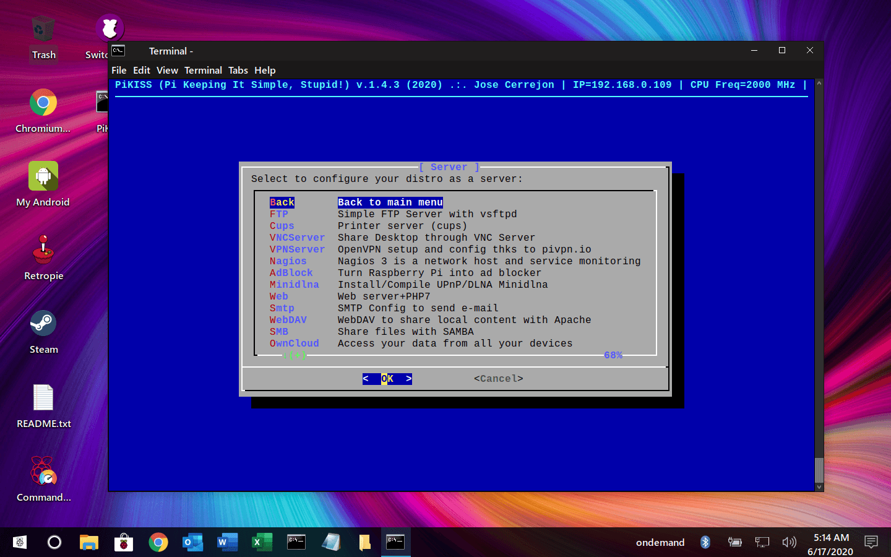

# PiKISS For Raspberry Pi: A Bunch Of Scripts With Menu To Make Your Life Easier


<p align="center">
 <a href="https://www.paypal.com/cgi-bin/webscr?cmd=_donations&business=ulysess%40gmail%2ecom&lc=GB&item_name=PiKISS&currency_code=EUR&bn=PP%2dDonationsBF%3abtn_donate_SM%2egif%3aNonHosted"></a>
 <a href='https://ko-fi.com/cerrejon' target='_blank'></a>
 <a href="https://github.com/jmcerrejon/neighborhood-games/blob/master/LICENSE"></a>
 <a href="https://x.com/ulysess10"></a>
 <a href="https://github.com/jmcerrejon/PiKISS/search?l=shell"></a>
 <a href="https://commerce.coinbase.com/checkout/71737f60-2440-488e-b413-f41e706f024b"></a>
</p>

## ⏰ Estimated hours of work so far

-   **1195 hours**

## 💰 Total amount donated by users & sponsors

-   $2.308,99

-   I want to thank for its contributions and help: [foxhound311](https://github.com/foxhound311), [phoenixbyrd](https://github.com/phoenixbyrd), [ptitSeb](https://github.com/ptitSeb) & [Moldytzu](https://github.com/Moldytzu), Kreal (krishenriksen.dk).

-   I want to thank my current patrons **Bo Martin, Rodney Hester & specially James Carroll** for trusting me. ❤️

-   Patrons support me in the past: _Jay Edwards, Tomás Delgado, Jeremy Palmer, cxgr, Willie D Kerner Jr, Matthew Michink, Mathew Gracie, Mike A. Torevell, David J Leto, Josiah McCracken._

-   Other users who helped me with donations are: _Ben Daghita, Timo Westphal, danoga, Roman Borowinski, Lenny Tua, Dan Suter, nunnz, Pi-Mania, Bernd Titze, Bogdan Moldovan, Thomas Wurgler, Paul Symes, George Kister, Agustino Dominguez, David Leahy, Jonathan Hodges, Mattias True, Sara J Shireman Anderson, Anthony Skiver, Shawn Mullins, Michaël Bortolin, William Norris, Jacob Ehrman, Karsten Schulz, Robert Napier, Patrick Michels_

-   [raspipc.es](https://www.raspipc.es/) ❤️

## 📣 Stay tuned

-   📬⠀Mail: <ulysess@gmail.com>

-   📖⠀Blog (English & Spanish): [misapuntesde.com](https://misapuntesde.com/)

-   🐦⠀ X (AKA Twitter): [@ulysess10](https://x.com/ulysess10)

-   👾⠀Discord for suggestions & support [thanks to Pi Labs](https://discord.gg/Y7WFeC5)

-   👨🏻‍💻⠀LinkedIn: [es.linkedin.com/in/jmcerrejon](https://es.linkedin.com/in/jmcerrejon/)

-   📣⠀Mewe (Spanish): [mewe.com](https://mewe.com/group/5c6bbed8f0e71669f228c457)

-   💰 ⠀Patreon: <https://patreon.com/cerrejon>

-   💰 ⠀Paypal: <https://paypal.me/jmcerrejon>

## 🤝 Contributors

-   [huelvayork](https://github.com/huelvayork), [mayavera](https://github.com/mayavera), [CleanMachine1](https://github.com/CleanMachine1), [kleinerm](https://github.com/kleinerm), [tx00100xt](https://github.com/tx00100xt).

-   Logo: grayduck

## TL;DR

Just type:

```sh-session
curl -sSL https://git.io/JfAPE | bash
```

## 🎥 Check what **PiKISS** can do for you on my Youtube's channel

-   [youtube.com > PIKISS](https://www.youtube.com/playlist?list=PLXhElW3ALmWh8p0mn1ZECawkKyF8QzNNP)

## ENGLISH

### [ Screenshots ]









### [ ChangeLog (dd/mm/yy)]

### (28/09/24)

· 📦 ADD: Mmedia > Spotube (Spotify Clone).

· 👌 IMPROVE: Others > Wine add Hangover v9.17 for aarch64.

### (06/09/24)

· 👌 IMPROVE: Others > Wine add Hangover v9.15 for aarch64.

· ❌ REMOVE: Others > Box86/Box64 installation (Only compilation is available).

### (03/09/24)

· 👌 IMPROVE: Emulation > PPSSPP v1.17.1-19410 (PSP Emulator) for aarch64.

### (20/08/24)

· 👌 IMPROVE: Games > Crispy-Doom 7.0.0 for aarch64.

### (10/07/24)

· 👌 IMPROVE: Games > Blood for aarch64.

· 👌 IMPROVE: Games > Xash3D (Half Life) for aarch64. Removed armfh support.

### (07/07/24)

· 👌 IMPROVE: Games > Arx Libertatis for aarch64.

· 🐛 FIX: Emulatos > residual.

### (24/06/24)

· 👌 IMPROVE: Games > Alien VS Predator for aarch64.

### (23/06/24)

· 👌 IMPROVE: Games > Abbaye des Morts 2.0.3 for aarch64.

### (16/06/24)

· 📦 ADD: Emulators > PCem for aarch64 (PCem is an emulator for old XT/AT-class PC).

### (09/06/24)

· 📦 ADD: Games > WipeOut for aarch64.

### (28/05/24)

· 👌 IMPROVE: Games > OpenClaw for aarch64.

· 👌 IMPROVE: Others > UXPlay (Airplay Mirroring) armhf & aarch64.

### (06/05/24)

· 📦 ADD: Games > Hexen 2 for aarch64 (using engine fteqw).

### (10/04/24)

· 📦 ADD: Devs > SQLiteStudio.

### (07/04/24)

· 🐛 FIX: Emulatos > mGBA.

### (02/04/24)

· 📦 ADD: Games > Unreal Tournament 99.

### (28/03/24)

· 🐛 FIX: Config > Vulkan driver.

### (15/03/24)

· 👌 IMPROVE: Others > Scrcopy v2.4 with Android 15 support.

### (08/03/24)

· 👌 IMPROVE: Config > Vulkan 24.0.0 & libdrm-2.4.120.

· 👌 IMPROVE: Games > Quake: Quakespasm (Quake I) v0.96.1 for aarch64.

· 👌 IMPROVE: Games > Quake: Latest Quake 2 with Vulkan support.

· 👌 IMPROVE: Games > Quake: Quake 3 now with aarch64 support.

· 👌 IMPROVE: Emulators > M.A.M.E. v0.263.

### (06/03/24)

· 👌 IMPROVE: Emulators > Unreal Speccy Emulator (ZX Spectrum) for armhf & aarch64.

### (05/03/24)

· 👌 IMPROVE: Games > Fallout 2 Community Edition (aarch64).

### (24/02/24)

· 👌 IMPROVE: Games > RVGL (AKA Re-Volt) v23.1030 for archhf & aarch64.

### (17/02/24)

· 👌 IMPROVE: Emulators > mGBA 0.11 (It supports Game Boy, Game Boy Color & Game Boy Advanced).

### (11/02/24)

· 👌 IMPROVE: Games > DXX-Rebirth 0.60 (Descent).

### (01/02/24)

· 👌 IMPROVE: Emulators > Redream (Sega Dreamcast).

...

To see the full list of changes, read the [CHANGELOG](./CHANGELOG)

## [ Introducing PiKISS ]

### _"Everything that can be automated, should be automated."_

Installing an application on Linux is not a complex task. Sometimes you just type _sudo apt install_ and get the application installed with all of its dependencies. But... What if we need to install more than one app such as a web server or it requires many steps to complete the install process? Is it not in the official repositories? What if you want to get rid of input commands?

"Please, make an easy way to set up my WIFI network!"

Don't despair. **PiKISS** has come to help you...

---

**PiKISS** _(Pi Keeping It Simple, Stupid!)_ is made with _scripts (Bash)_ for _Raspberry Pi 4 & 5_ boards which has a menu that will allow you to install some applications or configure files automatically as easy as possible. The ideal stage is:

-   _Raspberry PI OS Desktop_ Bullseye 32-bit. 64-bit support is comming slowly.

The idea is to offer facilities to manage your operating system, selecting an option in a menu and answer [Yes/No]. If you need to check dependencies, install an app, modify a script at boot, add a line to a file or download other, **PiKISS** will do it for you.

I included not only the ability to install, but also compile programs. Do you have problems when compiling your favorite emulator? Have you forgotten to modify a line in the source code and now you have to recompile again for 4 hours?. Laugh with **PiKISS**.

What some users have said about **PiKISS**:

-   _"It could have happened to me!"_

-   _"That's silly! (I'm going to install it as soon as I get home)"_

-   _"I don't need to fight with the terminal anymore? Shut up and take my money!."_ - Easy, it's free.

**NOTE:** 100% Free of viruses and Trojans. Not available in stores. The author of **PiKISS** is not responsible if you get bored with your _Raspberry Pi_ because everything is too easy. Online until I wish or _Internet_ is destroyed.

## [ Installation ]

Just type:

```sh-session
curl -sSL https://git.io/JfAPE | bash
```

## [ Data Files 🚨 ]

Honestly, I just want to let you get everything done without having to fight with the command line. The project has grown a lot, and the games I own and have been hosted on the internet, can't be there because of _Copyright_. I don't understand how a game that is older than 15 years old in some cases, has these so restrictive laws in some countries. Someone should do something about it.

**My solution to keep this project working is the following**: If you have copies saved for your use, just copy those links/paths in a file at `res/magic-air-copy-pikiss.txt`. You have an example of this file with instructions at [./res/magic-air-copy-pikiss.example](./res/magic-air-copy-pikiss.example). _PiKISS_ will read the links/files/directories in that file and install it for you when is required. Compatible and tested hosters: _dropbox.com, archive.org, anonfiles.com, pcloud.com_.

You can share this file _magic-air-copy-pikiss.txt_ with your brother/sister if you paid half price for the game and if the laws of your country allow it.

## [ Update ]

_PiKISS_ checks if new scripts are available on remote and updates them automatically, but if you want to get the latest version manually, just enter into the directory with cd PiKISS and type:

```sh-session
git pull
```

**NOTE:** If you use another distribution other than _Raspberry OS/TwisterOS_, maybe you need to execute the next command: _git config --global http.sslVerify false_

### [ HELP ME! ]

**PiKISS** grows up according to users requests or I'll append scripts that I consider necessary, but I call **to the community** to share, improve and help to add new scripts to the existing one. If the project grow, **is up to you**.

## ESPAÑOL

## PiKISS para Raspberry Pi: Un puñado de scripts con menú para hacerte la vida más fácil

### [ Presentando PiKISS ]

### _"Todo lo que pueda ser automatizado, debería estar automatizado."_

Instalar una aplicación en Linux no es complejo. A veces basta con un _sudo apt install_ y tendrás la aplicación con todas sus dependencias. Pero, ¿Y si tenemos que instalar más de una app como por ejemplo en un servidor web o necesita varios pasos para completar el proceso de instalación?, ¿Y si no está en los repositorios oficiales?, ¿Y si no quieres teclear? ¡Por favor, una manera fácil de instalar mi red WIFI!.

No desesperéis. Ha llegado **PiKISS** para ayudarte...

---

**PiKISS** _(Pi Keeping It Simple, Stupid!, "Pi manteniéndolo sencillo, ¡Estúpido!")_ son unos _scripts en Bash_ para placas _Raspberry Pi 4 y 5_ y testeado en _Raspberry PI OS Desktop_ Bullseye 32-bit (el soporte a 64-bit lo estoy haciendo poco a poco), que cuenta con un menú que te va a permitir instalar algunas aplicaciones o configurar ficheros de forma automática de la manera más fácil posible. **Su misión: Simplificar la instalación de software en _Raspberry Pi_.**

La idea es ofrecer facilidades para manejar tu distribución y que las instalaciones sean tan sencillas como seleccionar una opción en un menú y contestar [Si/No]. Si alguna conlleva algo más que instalar, por ejemplo modificar un script en el arranque, añadir una línea a un fichero, descargar otros ficheros, comprobar dependencias, **PiKISS** lo hará por ti.

Incluyo la posibilidad no solo de instalar, sino también de compilar programas. ¿Problemas a la hora de compilar tu emulador favorito?, ¿Se te ha olvidado modificar una línea en el código fuente de su autor y tienes que volver a recompilar durante 4 horas?. Ríete tú ahora de todo esto con **PiKISS**.

Lo que algunos usuarios han dicho de **PiKISS**:

-   _"¡Se me podría haber ocurrido a mí!"_

-   _"Menuda tontería (voy a instalarlo en cuanto llegue a casa)"_

-   _"¿Ya no tengo que pelearme con la terminal?. Cállate y coge mi dinero!"_ - Tranquilos, es gratis.

**NOTA:** 100% Libre de virus y troyanos. No disponible en tiendas. El autor de _PiKISS_ no se hace responsable si te aburres con tu _Raspberry Pi_ porque todo es demasiado fácil. Online hasta que me plazca o se destruya _Internet_.

### [ Instalación ]

Escribe en la terminal lo siguiente:

```sh-session
curl -sSL https://git.io/JfAPE | bash
```

## [ Ficheros de datos 🚨 ]

Sinceramente, lo único que quiero es que todo funcione sin tener que pelearme con la línea de comandos. El proyecto ha crecido mucho, y los juegos que yo poseo y que tenía alojados en internet, no pueden estar allí por motivos de _Copyright_. Tampoco entiendo como un juego que tiene más de 15 años en algunos casos, tienen estas leyes tan restrictivas en algunos países. Alguien debería hacer algo al respecto.

**Mi solución para que este proyecto siga funcionando es el siguiente**: Si tienes copias guardadas para tu uso, copia dichos enlaces/rutas en el fichero `res/magic-air-copy-pikiss.txt`. Tienes un ejemplo de este fichero en [./res/magic-air-copy-pikiss.example](./res/magic-air-copy-pikiss.example). _PiKISS_ leerá los enlaces/rutas de ese fichero y te instalará el que necesite cuando proceda. Hosters testeados y compatible: _dropbox.com, archive.org, anonfiles.com, pcloud.com_.

Este fichero _magic-air-copy-pikiss.txt_ lo puedes compartir con tu herman@ si pagásteis a medias el juego y si las leyes de tu país lo permiten.

### [ Actualizar ]

_PiKISS_ comprueba si hay nuevas actualizaciones en remoto y las actualiza automaticamente, pero si quieres conseguir la última versión de forma manual, teclea en el directorio de _PiKISS_:

```sh-session
git pull
```

**NOTA:** Si usas otra distribución que no sea _Raspberry OS/TwisterOS_ en la _Raspberry Pi_, tal vez tengas que ejecutar esta sencencia: _git config --global http.sslVerify false_

### [ ¡AYÚDAME! ]

**PiKISS** crecerá de acuerdo a las peticiones de los usuarios o añadiré los scripts que considere oportunos, pero hago un llamamiento a **toda la comunidad** para compartir, mejorar o agregar nuevos scripts a los ya existentes. Que este proyecto crezca **depende de tí**.
